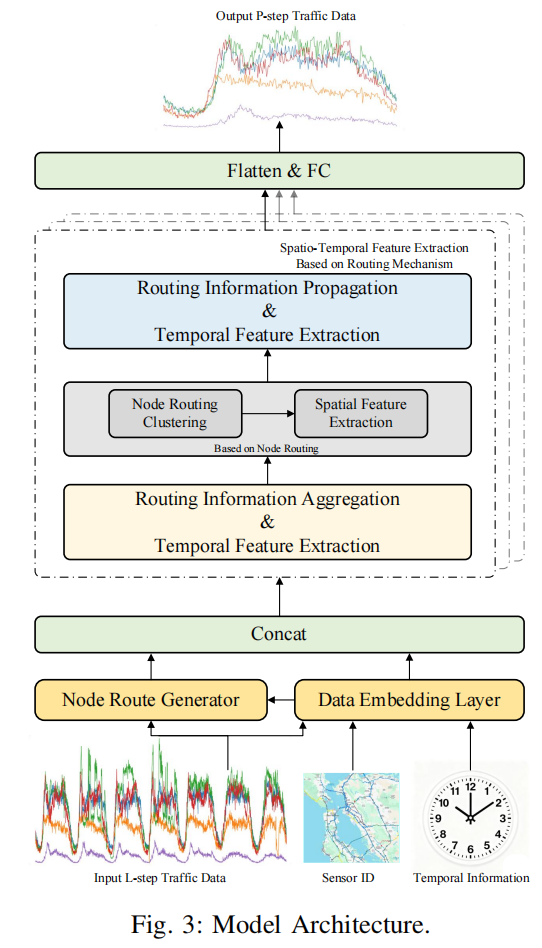
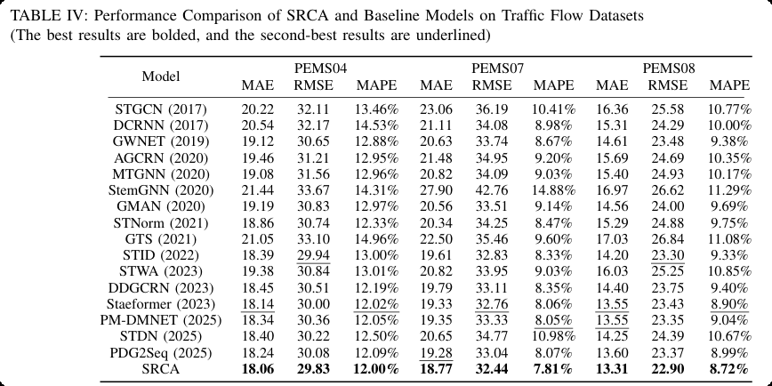
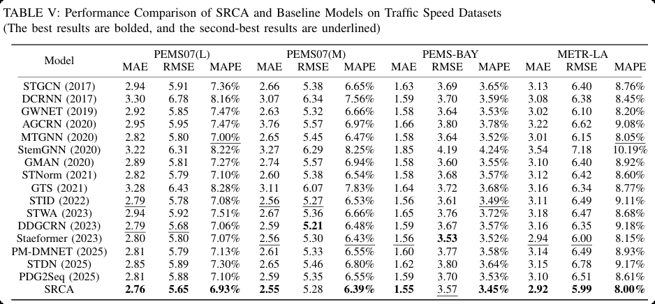

# SRCA_Office
Efficient Traffic Flow Forecasting via Sequence-Aware Node Routing and Cluster-Based Spatial Aggregation

Upload full code as soon as research is accepted
 
<p align="center">
  
</p>

#### Performance on Traffic Forecasting Benchmarks   

<p align="center">

   

</p>

<p align="center"> 

  

</p>
#### Required Packages

```
pytorch>=1.11
numpy
pandas
matplotlib
pyyaml
pickle
torchinfo
```

#### Training Commands

```bash
cd model/
sh train_all.sh
```

`<dataset>`:
- METRLA
- PEMSBAY
- PEMS04
- PEMS07
- PEMS08
- PEMS07L
- PEMS07M
